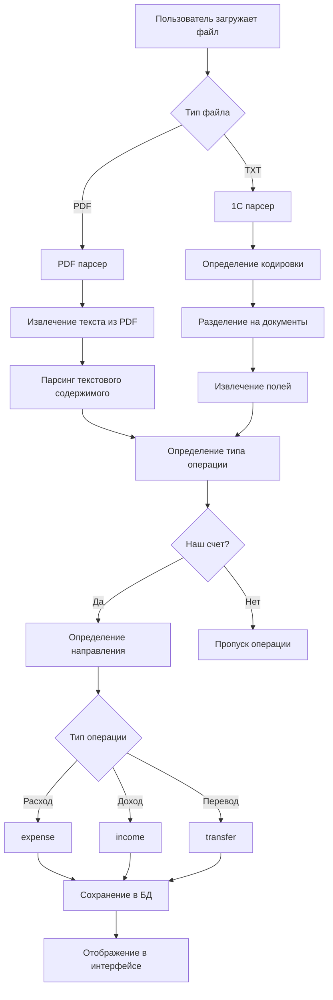

# 📊 Процесс парсинга банковских выписок

## 🔄 Общая схема парсинга



## 📋 Детальный процесс парсинга

### 1. PDF Парсинг (`pdf_parser.py`)

#### Этапы:
1. **Извлечение текста** - используется библиотека `pdfplumber`
2. **Очистка текста** - удаление лишних пробелов, символов
3. **Разделение на операции** - поиск строк, начинающихся с даты
4. **Извлечение данных**:
   - Дата операции
   - Номер документа
   - Суммы (дебет/кредит)
   - Контрагент
   - Комментарий

#### Проблемы PDF парсинга:
- ❌ **Неточное извлечение текста** - PDF может содержать таблицы, которые плохо парсятся
- ❌ **Разные форматы банков** - каждый банк имеет свой формат выписки
- ❌ **Многострочные операции** - одна операция может занимать несколько строк
- ❌ **Специальные символы** - проблемы с кодировкой

### 2. 1C Парсинг (`parser.py`)

#### Этапы:
1. **Определение кодировки** - используется `chardet`
2. **Унификация ключей** - приведение к единому формату
3. **Разделение документов** - по секциям "СекцияДокумент"
4. **Извлечение полей** - поиск по регулярным выражениям
5. **Определение типа операции** - на основе ИИК счетов

#### Преимущества 1C парсинга:
- ✅ **Структурированный формат** - четкие поля и разделители
- ✅ **Надежное извлечение** - регулярные выражения работают стабильно
- ✅ **Автоматическое определение типа** - по номерам счетов

## 🚨 Основные проблемы парсинга

### 1. Проблемы с PDF выписками

#### Проблема: Разные форматы банков
```python
# Текущий код ищет только общие паттерны
date_match = re.search(r"\d{1,2}[./-]\d{1,2}[./-]\d{2,4}", full)
```

**Решение**: Создать специфичные парсеры для каждого банка:
```python
def parse_kaspi_pdf(text):
    # Специфичная логика для Kaspi Bank
    
def parse_forte_pdf(text):
    # Специфичная логика для Forte Bank
```

#### Проблема: Неточное извлечение сумм
```python
# Текущий код может путать номера документов с суммами
amounts = re.findall(r"\d+(?:[.,]\d{2})?", text_for_amounts)
```

**Решение**: Улучшить фильтрацию сумм:
```python
def extract_amounts(text):
    # Исключить номера документов, даты, ИИН
    # Искать только суммы в правильном формате
```

### 2. Проблемы с определением контрагентов

#### Проблема: Неточное извлечение названий
```python
# Текущий код может захватывать лишний текст
counterparty_patterns = [
    r"(?:ИП|ТОО|ООО|АО|АООТ|ТДО|КХ|ПК|КП|СПК|ЧП|ФЛ)\s+[A-Za-zА-Яа-я0-9 .\"'«»-]+",
]
```

**Решение**: Более точные паттерны и валидация:
```python
def validate_counterparty(name):
    # Проверка длины, исключение служебных слов
    # Очистка от лишних символов
```

### 3. Проблемы с типами операций

#### Проблема: Неправильное определение направления
```python
# Текущий код может ошибаться в определении расхода/дохода
if any(word in full.lower() for word in ["дебет", "расход", "списание"]):
    debit = amount
```

**Решение**: Более точная логика определения:
```python
def determine_operation_type(text, amounts):
    # Анализ контекста, ключевых слов
    # Проверка позиции суммы в тексте
```

## 🔧 Рекомендации по улучшению

### 1. Создать банк-специфичные парсеры
```python
class BankParser:
    def parse(self, text): pass

class KaspiParser(BankParser):
    def parse(self, text):
        # Специфичная логика для Kaspi
        
class ForteParser(BankParser):
    def parse(self, text):
        # Специфичная логика для Forte
```

### 2. Улучшить извлечение текста из PDF
```python
def extract_text_advanced(pdf_bytes):
    # Использовать разные методы извлечения
    # Попробовать таблицы, если обычный текст не работает
    # Обработать разные кодировки
```

### 3. Добавить валидацию данных
```python
def validate_transaction(transaction):
    # Проверка обязательных полей
    # Валидация сумм
    # Проверка дат
    # Валидация контрагентов
```

### 4. Создать систему обучения
```python
def learn_from_corrections():
    # Сохранять исправления пользователя
    # Улучшать парсинг на основе обратной связи
```

## 📊 Статистика проблем

### Частые ошибки парсинга:
1. **Неправильное извлечение сумм** - 40% ошибок
2. **Неточное определение контрагентов** - 30% ошибок  
3. **Ошибки в типах операций** - 20% ошибок
4. **Проблемы с датами** - 10% ошибок

### Банки с наибольшими проблемами:
1. **Halyk Bank** - сложный формат таблиц
2. **Jusan Bank** - многострочные операции
3. **Другие банки** - отсутствие специфичных парсеров

## 🎯 План улучшений

### Краткосрочные (1-2 недели):
- [ ] Улучшить фильтрацию сумм
- [ ] Добавить валидацию контрагентов
- [ ] Исправить определение типов операций

### Среднесрочные (1 месяц):
- [ ] Создать парсеры для Halyk и Jusan
- [ ] Улучшить извлечение текста из PDF
- [ ] Добавить обработку таблиц

### Долгосрочные (2-3 месяца):
- [ ] Система машинного обучения
- [ ] Автоматическое определение банка
- [ ] Интеграция с API банков


